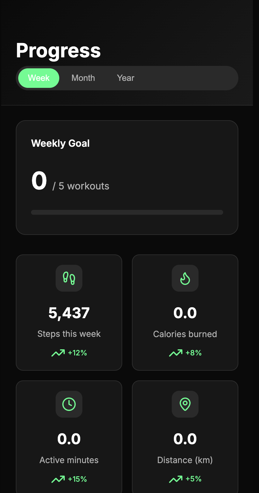
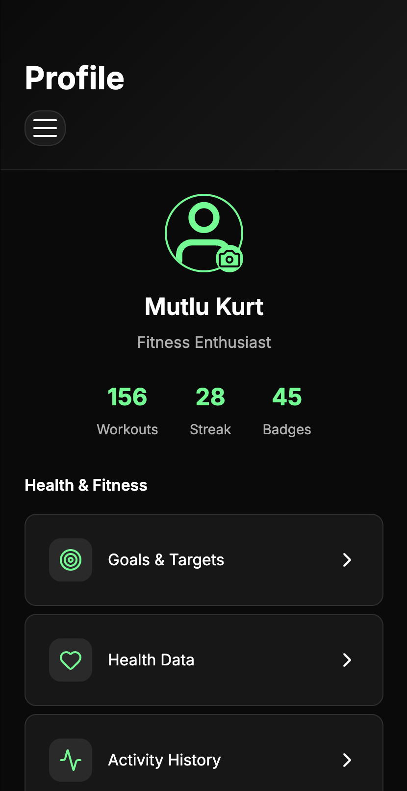
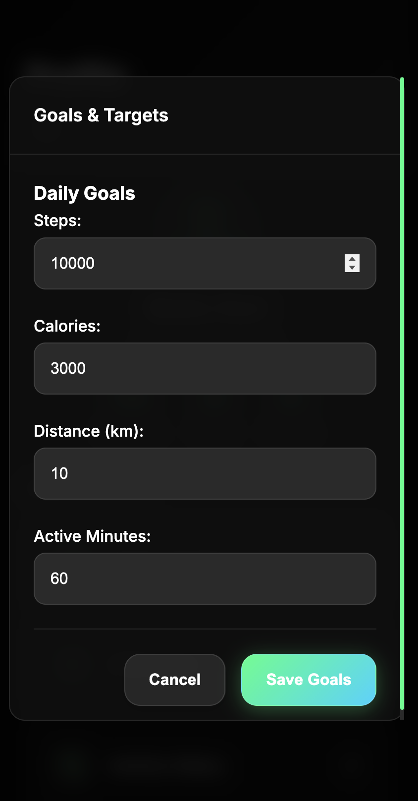
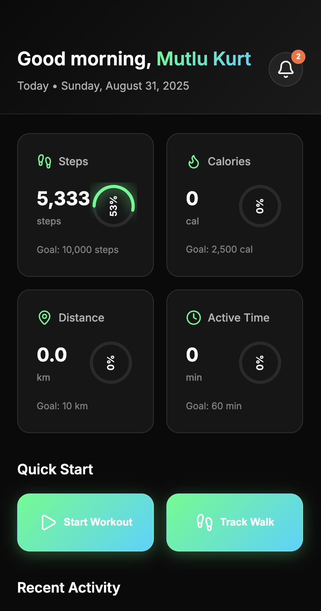
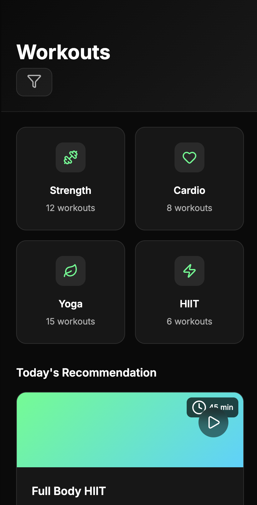
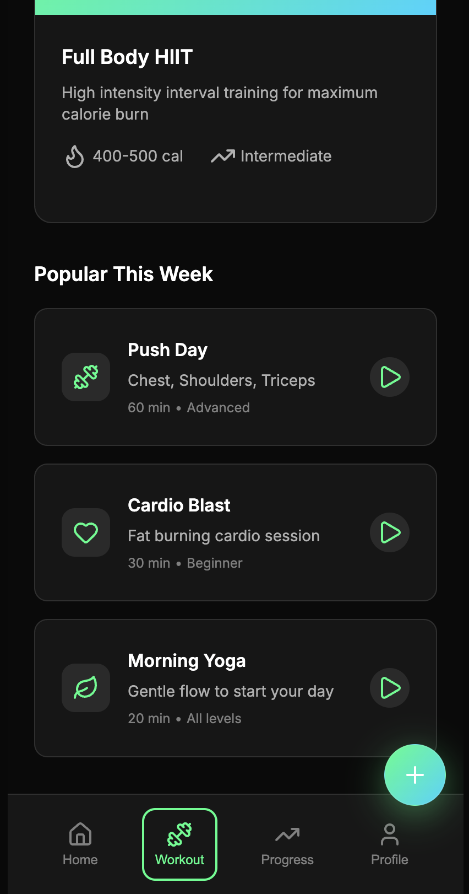

# 🏃‍♂️ FitVibe - Modern Fitness Tracker

<div align="center">

**A modern, responsive fitness tracking web application built with vanilla JavaScript, HTML5, and CSS3**

[](https://mutlukurt.github.io/FitVibe/)

[](https://opensource.org/licenses/MIT)
[](https://developer.mozilla.org/en-US/docs/Web/JavaScript)
[](https://www.w3.org/Style/CSS/)
[](https://developer.mozilla.org/en-US/docs/Learn/CSS/CSS_layout/Responsive_Design)

**[🌟 Try Live Demo](https://mutlukurt.github.io/FitVibe/)** • [Features](#features) • [Installation](#installation) • [Usage](#usage) • [Contributing](#contributing)

</div>

## 📱 Screenshots

<table>
<tr>
<td></td>
<td></td>
<td></td>
</tr>
<tr>
<td></td>
<td></td>
<td></td>
</tr>
</table>

## 🌟 Overview

FitVibe is a comprehensive fitness tracking web application designed to help users monitor their daily activities, set fitness goals, and track their progress over time. Built with modern web technologies and following mobile-first design principles, it provides an intuitive and engaging user experience across all devices.

## ✨ Features

### 📊 Dashboard & Analytics
- **Real-time Activity Tracking**: Monitor steps, calories burned, distance traveled, and active minutes
- **Progress Visualization**: Beautiful circular progress rings with smooth animations
- **Goal Management**: Set and track daily fitness goals
- **Activity History**: Comprehensive logging of all fitness activities

### 🏋️‍♀️ Workout Management
- **Workout Library**: Extensive collection of workouts across different categories
- **Workout Categories**: Strength, Cardio, Yoga, and HIIT workouts
- **Difficulty Levels**: Beginner to Advanced workout options
- **Custom Workouts**: Create and save personalized workout routines

### 📈 Progress Tracking
- **Weekly/Monthly/Yearly Views**: Comprehensive progress analytics
- **Achievement System**: Unlock badges and milestones
- **Trend Analysis**: Visual charts showing fitness improvements
- **Goal Achievement**: Track completion of fitness objectives

### 👤 User Profile & Social
- **Personal Profile**: Customize your fitness profile
- **Health Metrics**: BMI calculation and health data tracking
- **Social Features**: Connect with friends and join challenges
- **Settings Management**: Personalize app preferences

### 📱 Mobile-First Design
- **Responsive Layout**: Optimized for all screen sizes (320px to 1920px+)
- **Touch-Friendly Interface**: Intuitive gestures and interactions
- **Progressive Web App**: Works offline and can be installed on mobile devices
- **Fast Performance**: Smooth animations and quick load times

## 🛠️ Technology Stack

### Frontend
- **HTML5**: Semantic markup and accessibility features
- **CSS3**: Modern styling with custom properties, flexbox, and grid
- **JavaScript (ES6+)**: Modular architecture with classes and modules
- **Lucide Icons**: Beautiful, customizable SVG icons

### Architecture
- **Modular Design**: Separated concerns with dedicated managers
- **Event-Driven**: Custom event system for component communication
- **Local Storage**: Client-side data persistence
- **Responsive Design**: Mobile-first approach with breakpoints

### Key Components
```
├── js/
│   ├── dataManager.js      # Data persistence and management
│   ├── workoutManager.js   # Workout logic and tracking
│   ├── stepCounter.js      # Step counting and activity tracking
│   ├── healthManager.js    # Health metrics and BMI calculations
│   ├── achievementManager.js # Achievement system and badges
│   └── uiManager.js        # UI state and screen management
├── styles.css              # Modern CSS with custom properties
├── script.js               # Main application initialization
└── index.html              # Semantic HTML structure
```

## 🚀 Installation

### Prerequisites
- Modern web browser (Chrome 70+, Firefox 65+, Safari 12+, Edge 79+)
- Local web server (for development)

### Quick Start

1. **Clone the repository**
   ```bash
   git clone https://github.com/yourusername/fittracker.git
   cd fittracker
   ```

2. **Start a local server**
   ```bash
   # Using Python 3
   python -m http.server 8000
   
   # Using Node.js (if you have http-server installed)
   npx http-server
   
   # Using PHP
   php -S localhost:8000
   ```

3. **Open in browser**
   ```
   http://localhost:8000
   ```

### Alternative: Direct File Access
You can also open `index.html` directly in your browser, though some features may require a local server.

## 📖 Usage

### Getting Started

1. **First Launch**: The app will show an onboarding screen with feature highlights
2. **Dashboard**: View your daily activity summary and progress rings
3. **Set Goals**: Customize your daily step, calorie, and activity goals
4. **Track Activities**: Use the step counter or manually log workouts
5. **Monitor Progress**: Check your weekly/monthly progress in the Progress tab

### Key Features

#### Step Tracking
- Automatic step counting simulation
- Manual step entry
- Real-time progress updates
- Goal achievement notifications

#### Workout Management
- Browse workout categories (Strength, Cardio, Yoga, HIIT)
- Start workout sessions with timers
- Track workout completion
- Save favorite workouts

#### Progress Analytics
- View detailed statistics
- Track goal completion rates
- Monitor fitness trends
- Earn achievement badges

#### Profile Management
- Update personal information
- Set fitness goals
- Manage health data
- Customize app settings

## 🎨 Design Features

### Modern UI/UX
- **Dark Theme**: Sleek dark interface with accent colors
- **Smooth Animations**: 60fps animations with CSS transitions
- **Glass Morphism**: Modern frosted glass effects
- **Micro-interactions**: Subtle hover and click feedback

### Accessibility
- **Semantic HTML**: Proper heading hierarchy and landmarks
- **Keyboard Navigation**: Full keyboard accessibility
- **Screen Reader Support**: ARIA labels and descriptions
- **High Contrast**: Accessible color combinations

### Performance
- **Lightweight**: No external frameworks or heavy dependencies
- **Fast Loading**: Optimized assets and minimal HTTP requests
- **Smooth Scrolling**: Hardware-accelerated animations
- **Memory Efficient**: Proper cleanup and garbage collection

## 🔧 Configuration

### Customizing Goals
```javascript
// Default goals can be modified in dataManager.js
const defaultGoals = {
    daily: {
        steps: 10000,
        calories: 2500,
        distance: 10,
        activeMinutes: 60
    }
};
```

### Theme Customization
```css
/* Custom properties in styles.css */
:root {
    --accent-green: #00ff88;
    --accent-blue: #00d4ff;
    --accent-orange: #ff6b35;
    --accent-purple: #8b5cf6;
}
```

## 🤝 Contributing

We welcome contributions to FitTracker! Please follow these steps:

1. **Fork the repository**
2. **Create a feature branch**
   ```bash
   git checkout -b feature/amazing-feature
   ```
3. **Commit your changes**
   ```bash
   git commit -m 'Add some amazing feature'
   ```
4. **Push to the branch**
   ```bash
   git push origin feature/amazing-feature
   ```
5. **Open a Pull Request**

### Development Guidelines
- Follow ES6+ JavaScript standards
- Use semantic HTML and accessible markup
- Maintain responsive design principles
- Add comments for complex functionality
- Test across multiple browsers and devices

## 📱 Browser Support

| Browser | Version | Status |
|---------|---------|---------|
| Chrome  | 70+     | ✅ Fully Supported |
| Firefox | 65+     | ✅ Fully Supported |
| Safari  | 12+     | ✅ Fully Supported |
| Edge    | 79+     | ✅ Fully Supported |
| Opera   | 57+     | ✅ Fully Supported |

## 🐛 Known Issues

- Step counter uses simulation data (real pedometer integration requires native app)
- Offline functionality limited to cached data
- GPS tracking not implemented (planned for future release)

## 🗺️ Roadmap

### Version 2.0 (Planned)
- [ ] Real GPS tracking integration
- [ ] Social features and friend challenges
- [ ] Nutrition tracking
- [ ] Wearable device integration
- [ ] Advanced analytics and insights

### Version 1.5 (In Progress)
- [ ] PWA offline functionality
- [ ] Push notifications
- [ ] Data export/import
- [ ] Custom workout builder

## 📄 License

This project is licensed under the MIT License - see the [LICENSE](LICENSE) file for details.

## 👨‍💻 Author

**Mutlu Kurt**
- Email: mutlukurta@gmail.com
- GitHub: [@mutlukurt](https://github.com/mutlukurt)

## 🙏 Acknowledgments

- [Lucide Icons](https://lucide.dev/) for the beautiful icon set
- [Inter Font](https://rsms.me/inter/) for the clean typography
- Modern CSS techniques and best practices from the web development community

---

<div align="center">

**⭐ Star this repository if you found it helpful!**

Made with ❤️ by [Mutlu Kurt](https://github.com/mutlukurt)

</div>
